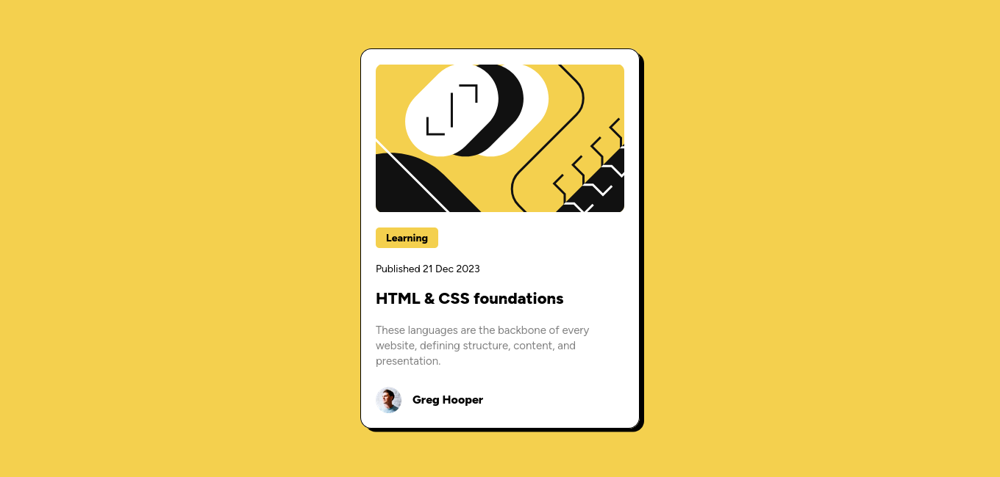
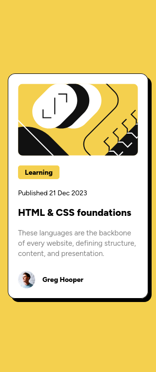

# Frontend Mentor - Solución de tarjeta de vista previa del blog

Esta es una solución al [desafío de tarjeta de vista previa del blog en Frontend Mentor](https://www.frontendmentor.io/challenges/blog-preview-card-ckPaj01IcS). Los desafíos de Frontend Mentor te ayudan a mejorar tus habilidades de codificación mediante la creación de proyectos realistas.

## Índice

- [Frontend Mentor - Solución de tarjeta de vista previa del blog](#frontend-mentor---solución-de-tarjeta-de-vista-previa-del-blog)
  - [Índice](#índice)
  - [Descripción general](#descripción-general)
    - [El desafío](#el-desafío)
    - [Captura de pantalla](#captura-de-pantalla)
      - [Desktop Desing](#desktop-desing)
      - [Mobil Desing](#mobil-desing)
    - [Enlaces](#enlaces)
  - [Mi proceso](#mi-proceso)
    - [Creado con](#creado-con)
  - [Autor](#autor)

## Descripción general

### El desafío

Los usuarios deberían poder:

- Ver los estados de desplazamiento y enfoque de todos los elementos interactivos de la página

### Captura de pantalla

#### Desktop Desing

#### Mobil Desing

### Enlaces

- URL de la solución: [Github](https://github.com/jean266/Tarjeta_vista_previa_001.git)
- URL del sitio en vivo: [Vercel]()
  
## Mi proceso

### Creado con

- Marcado HTML5 semántico
- Flexbox
- Flujo de trabajo para dispositivos móviles
- Gulp
- SASS

## Autor

- Mentor de frontend: [@jean266](https://www.frontendmentor.io/profile/jean266)